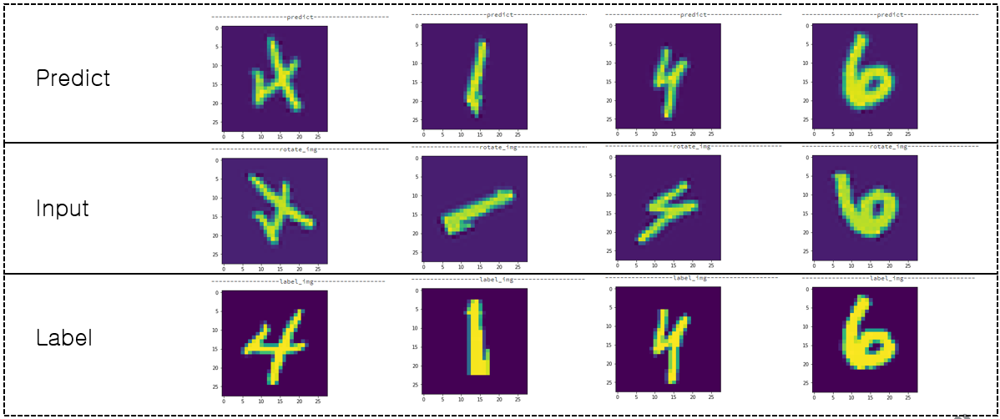

# Spatial_Transform_Network

I made STN by using Low level Tensorflow api because the network needs initial value for theta.

Here is the output.

I test my network in rotated image and translated image.
The upper one is the output in rotated image. And the lower one is the output in translted image.

